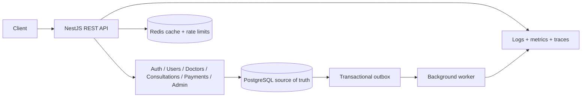
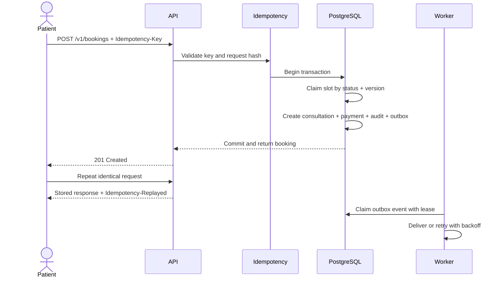

# Amrutam Telemedicine Backend

NestJS REST API for the Amrutam backend assignment. It supports secure authentication, doctor discovery and availability, consultation booking, prescriptions, payments, audit logs, and admin analytics.

## Video Demo flow

[Loom Video Demo Link](https://www.loom.com/share/a58cc4123ac545fe92a5e0d2a47f4afb)

### 1. System overview



- Composition and startup: [application modules](src/app.module.ts), [API bootstrap](src/bootstrap.ts), [worker entry point](src/worker.ts)
- System design: [architecture and data-flow diagrams](docs/architecture.md)
- API contract: [OpenAPI schema](openapi.json) and Swagger UI at `/docs`
- Runtime stack: [Docker Compose](docker-compose.yml) and [production image](Dockerfile)

### 2. End-to-end product flow

| Step | Demonstrate                                                                                                                 | Main references                                                                                                                                                                                                       |
| ---- | --------------------------------------------------------------------------------------------------------------------------- | --------------------------------------------------------------------------------------------------------------------------------------------------------------------------------------------------------------------- |
| 1    | Register/login -> JWT access and rotating refresh token -> optional TOTP MFA                                                | [auth controller](src/modules/auth/auth.controller.ts), [auth service](src/modules/auth/auth.service.ts), [JWT strategy](src/modules/auth/jwt.strategy.ts)                                                            |
| 2    | Admin approves doctor -> patient searches approved doctors -> views future slots                                            | [admin service](src/modules/admin/admin.service.ts), [doctor controller](src/modules/doctors/doctors.controller.ts), [doctor service](src/modules/doctors/doctors.service.ts)                                         |
| 3    | Doctor publishes availability -> overlap protection -> cache invalidation                                                   | [doctor service](src/modules/doctors/doctors.service.ts), [database migration](prisma/migrations/20260918000100_init/migration.sql)                                                                                   |
| 4    | Patient books with `Idempotency-Key` -> slot claimed -> consultation, payment, audit, and outbox event committed atomically | [consultation service](src/modules/consultations/consultations.service.ts), [idempotency service](src/common/services/idempotency.service.ts), [data model](prisma/schema.prisma)                                     |
| 5    | Same request replays safely -> competing booking loses -> no double booking                                                 | [booking unit tests](test/unit/consultations.service.spec.ts), [end-to-end workflow](test/app.e2e-spec.ts)                                                                                                            |
| 6    | Assigned doctor starts/completes consultation -> issues encrypted prescription -> patient reads it                          | [consultation controller](src/modules/consultations/consultations.controller.ts), [consultation service](src/modules/consultations/consultations.service.ts), [crypto service](src/common/services/crypto.service.ts) |
| 7    | Payment follows guarded state transitions -> retries remain idempotent                                                      | [payment controller](src/modules/payments/payments.controller.ts), [payment service](src/modules/payments/payments.service.ts)                                                                                        |
| 8    | Worker claims committed events -> retries with backoff -> dead-letters exhausted events                                     | [outbox service](src/outbox/outbox.service.ts), [worker](src/worker.ts), [outbox tests](test/unit/outbox.service.spec.ts)                                                                                             |
| 9    | Every sensitive action is audited -> admin views logs and bounded analytics                                                 | [audit service](src/common/services/audit.service.ts), [admin controller](src/modules/admin/admin.controller.ts), [admin service](src/modules/admin/admin.service.ts)                                                 |

#### Booking sequence



### 3. Architecture decisions

| Topic                | Design                                                                                                                                                                                                          |
| -------------------- | --------------------------------------------------------------------------------------------------------------------------------------------------------------------------------------------------------------- |
| Scale and latency    | Target: 100k consultations/day, read p95 `<200 ms`, write p95 `<500 ms`; stateless API/worker replicas, pagination, Redis caching, indexed PostgreSQL access, and [k6 booking load test](tests/load/booking.js) |
| Availability         | Target: `99.95%`; multiple replicas, [autoscaling](infra/k8s/hpa.yaml), [disruption budget](infra/k8s/pdb.yaml), readiness/liveness probes, and safe Redis degradation                                          |
| Transaction boundary | Booking commits the slot claim, consultation, payment, audit, idempotency result, and outbox event in one PostgreSQL transaction; the outbox coordinates asynchronous work instead of a distributed saga        |
| Concurrency          | Versioned conditional writes, unique/exclusion constraints, and idempotency keys; PostgreSQL remains the final consistency boundary                                                                             |
| Retry policy         | Bounded exponential backoff, jitter, leased event claims, expired-lease recovery, maximum attempts, then dead-letter status                                                                                     |
| Data growth          | Time-based partitioning path for high-volume `consultations`, `audit_logs`, and `outbox_events`; retain indexed operational windows and archive older partitions                                                |
| Backup and DR        | Production path: managed PostgreSQL point-in-time recovery, encrypted backups, cross-region copies, restore drills, and separately backed-up secrets/keys; external services remain deployment responsibilities |
| Assumptions          | Targets and production-managed boundaries are stated in [assumptions](docs/assumptions.md) and [security production requirements](docs/security.md#production-requirements)                                     |

### 4. Production-readiness proof

| Area          | What to point out                                                                                                                                                          | Main references                                                                                                                                                                |
| ------------- | -------------------------------------------------------------------------------------------------------------------------------------------------------------------------- | ------------------------------------------------------------------------------------------------------------------------------------------------------------------------------ |
| Security      | Argon2, JWT rotation, MFA, RBAC, validation, rate limiting, encrypted fields, key rotation, enumeration protection, immutable audit logs, OWASP threat controls            | [security and threat model](docs/security.md), [guards](src/common/guards), [environment validation](src/config/env.validation.ts), [security tests](test/unit/guards.spec.ts) |
| Reliability   | PostgreSQL transactions, optimistic concurrency, database overlap constraints, idempotent writes, transactional outbox, leases, retries, exponential backoff, dead letters | [architecture](docs/architecture.md), [initial migration](prisma/migrations/20260918000100_init/migration.sql), [idempotency tests](test/unit/idempotency.service.spec.ts)     |
| Scalability   | Stateless API, separate worker, Redis cache/rate limits, indexed search and ownership paths, pagination, horizontal autoscaling, partitioning path for high-volume tables  | [architecture scaling](docs/architecture.md), [Prisma indexes](prisma/schema.prisma), [API HPA](infra/k8s/hpa.yaml), [load test](tests/load/booking.js)                        |
| Observability | Correlation IDs, structured logs, HTTP/process/outbox metrics, traces, dashboards, alerts, liveness, readiness, Redis degradation                                          | [metrics](src/common/observability), [tracing](src/tracing.ts), [health controller](src/modules/health/health.controller.ts), [observability stack](infra/observability)       |
| Deployment    | Multi-stage/non-root container, PostgreSQL and Redis services, migration job, API/worker separation, probes, PDB, network policy, ingress, immutable release images        | [Dockerfile](Dockerfile), [Compose stack](docker-compose.yml), [Kubernetes manifests](infra/k8s), [release pipeline](.github/workflows/release.yml)                            |
| Quality       | Modular DI, DTO validation, Problem Details errors, unit/E2E/load tests, coverage gates, lint, types, deterministic OpenAPI, dependency and container scans                | [source modules](src/modules), [Problem Details filter](src/common/filters/problem-details.filter.ts), [tests](test), [CI pipeline](.github/workflows/ci.yml)                  |

### 5. Assignment coverage

| Requested item                                                                                              | Evidence                                                                                                                                                                |
| ----------------------------------------------------------------------------------------------------------- | ----------------------------------------------------------------------------------------------------------------------------------------------------------------------- |
| Code and infrastructure as code                                                                             | [source](src), [database](prisma), [Docker Compose](docker-compose.yml), [Kubernetes](infra/k8s)                                                                        |
| README setup                                                                                                | [local setup](#run-locally), [Docker setup](#run-with-docker), [.env template](.env.example)                                                                            |
| REST API schema                                                                                             | [OpenAPI JSON](openapi.json), [schema generator](scripts/generate-openapi.ts)                                                                                           |
| High-level architecture and data flow                                                                       | [architecture document](docs/architecture.md)                                                                                                                           |
| Booking sequence diagram                                                                                    | [booking sequence](#booking-sequence), [booking implementation](src/modules/consultations/consultations.service.ts)                                                     |
| ER diagram and required core tables                                                                         | [ER diagram](docs/architecture.md#data-model), [Prisma schema](prisma/schema.prisma), [migration](prisma/migrations/20260918000100_init/migration.sql)                  |
| Retry/backoff, caching, concurrency, transactions, sagas/outbox, partitioning, backup/DR                    | [architecture decisions](#architecture-decisions), [architecture document](docs/architecture.md)                                                                        |
| User, doctor, booking, consultation, prescription, search, audit, and analytics flows                       | [API overview](#api-overview), [application modules](src/modules)                                                                                                       |
| Encryption, MFA, RBAC, OWASP, attack surface, data classification, key rotation, audit, dependency scanning | [security checklist and threat model](docs/security.md), [CI security scans](.github/workflows/ci.yml)                                                                  |
| Metrics, logs, and traces                                                                                   | [observability configuration](infra/observability), [application instrumentation](src/common/observability)                                                             |
| Automated tests and CI/CD                                                                                   | [unit tests](test/unit), [E2E test](test/app.e2e-spec.ts), [load test](tests/load/booking.js), [CI](.github/workflows/ci.yml), [release](.github/workflows/release.yml) |
| Containerized deployment                                                                                    | [Dockerfile](Dockerfile), [Compose](docker-compose.yml), [Kubernetes](infra/k8s)                                                                                        |
| Assumptions and boundaries                                                                                  | [assumptions](docs/assumptions.md)                                                                                                                                      |

## Tech stack

- Node.js 22, TypeScript, and NestJS
- PostgreSQL with Prisma
- Redis for rate limiting and short-lived caches
- Jest, Docker Compose, OpenAPI, Prometheus, and OpenTelemetry

## Implemented features

- Patient, doctor, and admin roles with JWT access/refresh tokens
- Argon2 password hashing, refresh-token rotation, TOTP MFA, RBAC, and rate limiting
- Doctor registration, admin activation, search, and availability management
- Concurrency-safe and idempotent consultation booking
- Consultation status transitions and encrypted prescriptions
- Payment status management
- Append-only audit logs and admin analytics
- Transactional outbox worker for asynchronous tasks
- Health checks, metrics, structured logs, and tracing

## Run locally

Requirements: Node.js 22+, PostgreSQL 16+, and Redis 7+.

```bash
npm ci
cp .env.example .env
npm run prisma:migrate
npm run start:dev
```

On PowerShell, use `Copy-Item .env.example .env` instead of `cp`.

Run the worker in another terminal:

```bash
npm run dev:worker
```

The API runs at `http://localhost:3000`; Swagger UI is available at `http://localhost:3000/docs`.

## Run with Docker

```bash
cp .env.example .env
docker compose up --build -d
```

Check the service with `curl http://localhost:3000/health/ready` and stop it with `docker compose down`.

## Admin setup

Create the initial administrator after the database is migrated:

```bash
SEED_ADMIN_EMAIL=admin@example.com \
SEED_ADMIN_PASSWORD='Change-Me-Now!123' \
npm run prisma:seed
```

The admin should enroll in MFA before using protected admin endpoints.

## Validation

```bash
npm run typecheck
npm run lint
npm test
npm run test:e2e
npm run build
```

`npm test` prints every verified behavior grouped by subsystem and finishes with the total passed checks. `npm run test:e2e` requires PostgreSQL and Redis plus the test environment variables used by [CI](.github/workflows/ci.yml).

## API overview

All application routes use the `/v1` prefix.

| Area           | Main routes                                                                  |
| -------------- | ---------------------------------------------------------------------------- |
| Authentication | `/v1/auth/register`, `/login`, `/refresh`, `/logout`, `/mfa/*`               |
| Users          | `/v1/users/me`, `/v1/admin/users`                                            |
| Doctors        | `/v1/doctors`, `/v1/doctors/:id/availability`, `/v1/doctors/me/availability` |
| Consultations  | `/v1/bookings`, `/v1/consultations`                                          |
| Payments       | `/v1/admin/payments/:id/status`                                              |
| Admin          | `/v1/admin/analytics`, `/v1/admin/audit-logs`                                |
| Operations     | `/health/live`, `/health/ready`, `/metrics`                                  |

Creating availability, bookings, and prescriptions requires an `Idempotency-Key` header. See [openapi.json](openapi.json) or Swagger UI for request and response schemas.

## Documentation

- [Architecture](docs/architecture.md)
- [Security](docs/security.md)
- [Assumptions](docs/assumptions.md)
