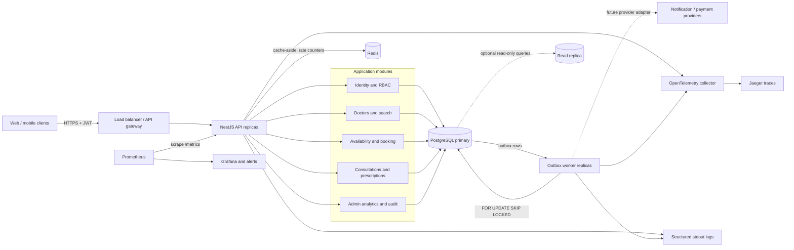
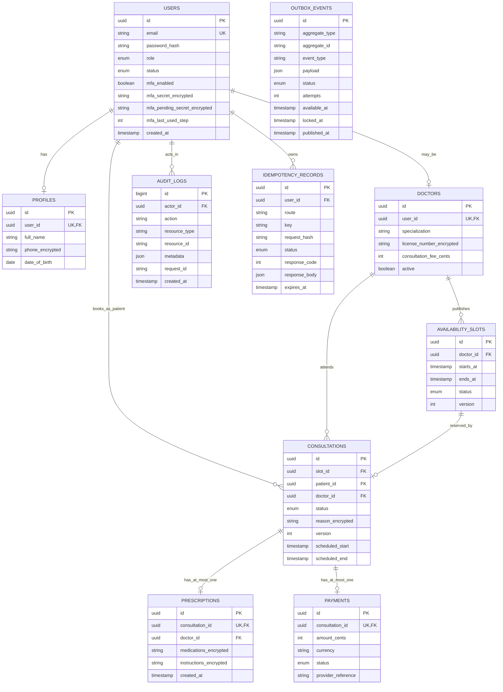

# Amrutam Telemedicine Backend Architecture

**Status:** implementation baseline  
**Style:** REST API in a NestJS/TypeScript modular monolith, PostgreSQL as the system of record, Redis for cache and rate limiting, and a PostgreSQL transactional-outbox worker.

## 1. Goals and boundaries

The backend implements identity and roles, doctor discovery and availability, conflict-free booking, consultation state transitions, prescriptions, auditable administration, and analytics. The design targets 100,000 consultations per day, p95 latency below 200 ms for reads and 500 ms for writes, and 99.95% monthly availability. PostgreSQL remains authoritative; caches and workers may fail without permitting double booking or losing committed work.

The first deployment is a modular monolith. Modules have explicit interfaces and dependency injection, but one deployable and one database keep cross-module consistency simple. Independently scaling API and worker processes preserves a path to extract a service only when traffic or ownership justifies it.

## 2. High-level architecture and data flow



For an idempotent write, the API authenticates the caller, authorizes the action, validates input and the idempotency key, then commits the domain change, audit entry, idempotency result, and any outbox event in one PostgreSQL transaction. The response is returned only after commit. Workers claim outbox rows with `FOR UPDATE SKIP LOCKED`, recover five-minute expired leases, and record completion. The reference worker currently logs dispatch and marks the event published; real notification/payment adapters remain an integration seam and must deduplicate by event ID.

The implemented cache-aside paths are public doctor search with a 30-second Redis TTL and aggregate admin analytics with a 60-second TTL. Creating or blocking availability and changing doctor activation invalidate doctor-search keys; analytics staleness is bounded by its TTL. Availability listing, authorization, booking ownership, and slot claims read PostgreSQL directly and never rely on cached values.

## 3. Booking flow

```mermaid
sequenceDiagram
    autonumber
    actor Patient
    participant API as Booking API
    participant DB as PostgreSQL
    participant Worker as Outbox worker

    Patient->>API: POST /v1/bookings (slotId, Idempotency-Key)
    API->>API: Authenticate, authorize PATIENT, validate
    API->>DB: BEGIN; claim key/hash; replace only if the stored row expired
    alt completed key with same hash
        DB-->>API: Stored status and response
        API-->>Patient: Replay original response
    else key reused with different payload or still processing
        API->>DB: ROLLBACK
        API-->>Patient: 409 Problem Details
    else new request
        API->>DB: Read slot, version, and doctor
        API->>DB: Check future and doctor active
        API->>DB: UPDATE slot to BOOKED WHERE status=AVAILABLE AND version=expected
        API->>DB: Insert SCHEDULED consultation and PENDING payment
        API->>DB: Insert audit log, outbox event, and stored response
        API->>DB: COMMIT
        API-->>Patient: 201 consultation
        Worker->>DB: Claim event FOR UPDATE SKIP LOCKED
        Worker->>Worker: Log dispatch with stable event ID
        Worker->>DB: Mark event processed
        Note right of Worker: A real provider adapter is a future integration seam
    end
```

The slot claim is an atomic expected-version update, not `SELECT ... FOR UPDATE`: it succeeds only while the row is `AVAILABLE` at the version just read. A partial unique index on `consultations.slot_id` for non-cancelled/non-no-show consultations is the final invariant. Redis locks are deliberately avoided. Two different idempotency keys racing for the same slot yield one success and one `409` with the detail `Slot is no longer available`; replaying the winning key returns the stored result.

## 4. Logical data model



Foreign keys, check constraints, and unique indexes enforce domain invariants. UTC `timestamptz` values are used for instants. Overlapping doctor availability is prevented with a PostgreSQL exclusion constraint on `(doctor_id, tstzrange(starts_at, ends_at))` while slots are `AVAILABLE` or `BOOKED`. A database trigger rejects updates and deletes on `audit_logs`; the service writes identifier metadata rather than clinical payloads.

## 5. API and schema overview

The committed, generated OpenAPI contract currently describes 25 operations. Errors use an RFC 7807-style body with `type`, `title`, `status`, `detail`, `instance`, `requestId`, and `timestamp`; there is no separate stable application-error code or trace ID in the response. Paginated collection reads use offset-style `page`/`limit` parameters and return `items`, `page`, `limit`, and `total`. Request bodies reject unknown fields.

| Area             | Representative operations                                                                                                                                                                            | Access and consistency                                                                                                                                                                             |
| ---------------- | ---------------------------------------------------------------------------------------------------------------------------------------------------------------------------------------------------- | -------------------------------------------------------------------------------------------------------------------------------------------------------------------------------------------------- |
| Identity/profile | `POST /v1/auth/register`, `/login`, `/refresh`, `/logout`, `/mfa/setup`, `/mfa/verify`; `GET/PATCH /v1/users/me`                                                                                     | Registration/login/refresh are public; the remainder use bearer authentication                                                                                                                     |
| Doctors          | `GET /v1/doctors`, `GET /v1/doctors/{id}/availability`                                                                                                                                               | Public; doctor search supports `page`, `limit`, `search`, `specialization`, fee bounds, and `availableFrom`                                                                                        |
| Availability     | `POST /v1/doctors/me/availability`, `PATCH /v1/doctors/me/availability/{id}/block`                                                                                                                   | Owning doctor with MFA; create is idempotent and overlap-constrained                                                                                                                               |
| Booking          | `POST /v1/bookings`                                                                                                                                                                                  | Patient creates with required `Idempotency-Key`, `slotId`, and `reason`                                                                                                                            |
| Consultation     | `GET /v1/consultations`, `GET /v1/consultations/{id}`, `PATCH /v1/consultations/{id}/status`                                                                                                         | Patient/assigned-doctor scope only; doctors need MFA for valid transitions with body `expectedVersion`; patients may cancel their own future scheduled consultation; admins have no clinical route |
| Prescription     | `POST /v1/consultations/{id}/prescriptions`                                                                                                                                                          | Assigned MFA-authenticated doctor creates one immutable prescription; reads are embedded in consultation responses                                                                                 |
| Administration   | `GET /v1/admin/users`, `PATCH /v1/admin/users/{id}/status`, `PATCH /v1/admin/doctors/{id}/activation`, `PATCH /v1/admin/payments/{id}/status`, `GET /v1/admin/analytics`, `GET /v1/admin/audit-logs` | Admin role plus MFA; list endpoints use bounded offset pagination or date ranges                                                                                                                   |
| Operations       | `GET /health/live`, `/health/ready`, `/metrics`                                                                                                                                                      | Public at the application layer; the Kubernetes ingress exposes only `/v1`, while monitoring/probes reach pod/service networking                                                                   |

Idempotency is implemented on booking, availability creation, and prescription creation. Keys are 8-100 URL-safe characters and are scoped to `(user, route, key)`. Same-key/same-body retries replay a completed result; a different body or a duplicate still in `PROCESSING` returns 409. Each row receives an `expires_at` value 24 hours ahead. The claim query atomically replaces an expired row, so the key becomes reusable after that boundary; physical cleanup of old rows remains an operations task. Consultation updates carry `expectedVersion` in the JSON body rather than `If-Match`.

## 6. Reliability, retries, transactions, and sagas

- **Inbound guidance:** clients may retry safe reads. A write is retried only with the same idempotency key; authentication, validation, authorization, and domain conflicts are not retryable. The server does not currently perform general request/database retries.
- **Database:** idempotent mutations use a `READ COMMITTED` Prisma transaction with a 10-second transaction timeout. Booking resolves contention through a conditional expected-version update and database constraints.
- **Outbox:** workers claim up to 25 due rows using `FOR UPDATE SKIP LOCKED`, mark them `PROCESSING`, and recover leases older than five minutes. Failure schedules `min(300, 2^attempts) + 0..2` seconds of backoff; the default eighth failure becomes `DEAD_LETTER`.
- **Adapters:** the reference handler logs dispatch and marks the event `PUBLISHED`. Provider calls, timeouts, circuit breakers, downstream idempotency, and authenticated replay tooling are explicit production integration work.

A local operation uses one ACID transaction. Booking atomically reserves a slot and creates the `SCHEDULED` consultation, `PENDING` payment, audit row, idempotency result, and outbox event. Issuing the single prescription atomically writes the prescription, audit row, idempotency result, and event. No external payment saga is implemented. A future provider flow would advance payment through `PENDING -> AUTHORIZED -> CAPTURED` (or `FAILED`/`REFUNDED`) and use an explicit compensation to release a slot when product policy requires it.

## 7. Scale, partitioning, caching, and concurrency

100,000 consultations/day is about **1.16 consultations/s average**. With a 10x peak and an estimated 20 API interactions per consultation, planning load is approximately **230 requests/s peak**. The k6 scenario is configurable and asserts the assignment's 200 ms read/500 ms write p95 thresholds; 500 sustained requests/s remains a validation target, not a measured result committed by this repository. Five domain writes per consultation imply roughly 6 writes/s average and 60/s at 10x peak.

API and worker replicas are stateless and scale independently. The migration enables `pg_trgm` and adds GIN trigram indexes for user email, profile full name, and doctor specialization, matching the admin/doctor `contains` searches. Other indexes cover unique normalized-at-write email, doctor specialization/active state and fee, `(doctor_id, starts_at)`, consultation patient/doctor/status time access, audit time/resource, and outbox `(status, available_at)`. Query plans and pool saturation, not daily volume alone, trigger scaling.

All current tables, including `audit_logs`, are unpartitioned. Audit has time/resource indexes, but monthly range partitioning is a future migration once measured size or maintenance latency warrants it. Processed-outbox and expired-idempotency cleanup are not implemented and remain retention/size-management tasks for a long-running deployment. Consultations and payments remain unpartitioned to preserve simple uniqueness and foreign keys.

Redis caches doctor-search responses for 30 seconds, aggregate admin analytics for 60 seconds, and stores fixed-window rate counters. There is no availability cache, TTL jitter, negative cache, request coalescing, or token-bucket algorithm in the current code. If Redis is unavailable, cache reads miss and a bounded in-process fixed-window limiter is used per API replica; booking correctness is unaffected. Readiness then reports `degraded` while remaining HTTP 200 because PostgreSQL is the required dependency.

## 8. SLOs and observability

| SLI                            |      Objective | Measurement                                                                                    |
| ------------------------------ | -------------: | ---------------------------------------------------------------------------------------------- |
| Availability                   | 99.95% monthly | Eligible API requests not returning unexpected 5xx; monthly error budget is about 21.6 minutes |
| Read latency                   |   p95 < 200 ms | Server-side duration for successful GET/HEAD requests                                          |
| Write latency                  |   p95 < 500 ms | Server-side duration for successful mutating requests, through commit                          |
| Outbox freshness (planned SLI) |     p95 < 60 s | Requires an outbox age/delivery metric that is not yet emitted                                 |

Pino emits structured request logs with an `x-request-id`; configured redaction covers authorization/cookie headers, passwords, refresh tokens, and MFA fields. OpenTelemetry auto-instrumentation exports traces when `OTEL_EXPORTER_OTLP_ENDPOINT` is configured. Prometheus exposes HTTP request count/duration, default Node.js/process metrics, and a database-backed `amrutam_outbox_events{status}` gauge that emits zero-valued series for absent statuses. Checked-in alerts cover API down, 5xx rate, read/write p95, memory pressure, pending-outbox backlog, and any dead-letter row; Grafana includes the corresponding outbox panels. Booking conflicts, database-pool wait, cache hit rate, rate-limit rejection, oldest-outbox age/retry rate, worker throughput, and security-denial metrics remain planned instrumentation.

## 9. Deployment, backup, and disaster recovery

The Kubernetes reference declares three API replicas and two worker replicas, rolling updates, topology-spread preferences, probes, resource limits, non-root users, read-only root filesystems, dropped capabilities, PodDisruptionBudgets, and CPU/memory HPAs for the API plus a CPU HPA for the worker. A one-shot migration Job applies the schema, while API/worker init containers wait for the expected schema before starting. The release workflow first invokes the reusable CI workflow, publishes runtime/migration images with SBOM/provenance attestations, and renders manifests pinned to registry digests rather than mutable tags. Actual multi-zone placement depends on the target cluster. The manifests consume a Kubernetes Secret example; integration with a managed external secret store is still a production gate. Managed PostgreSQL/Redis and their failover topology are assumed external services, not provisioned here.

The production design target is **RPO <= 5 minutes** and **RTO <= 60 minutes**, using managed PostgreSQL point-in-time recovery, encrypted backups, and a cross-region copy. Redis is reconstructable; pending work lives in PostgreSQL outbox rows. This repository does not configure a managed database, WAL archive, backup schedule, cross-region copy, or restore automation. A 35-day retention policy, daily verification, monthly restore test, quarterly failover exercise, and separately protected key inventory are production runbook gates rather than demonstrated capabilities.
