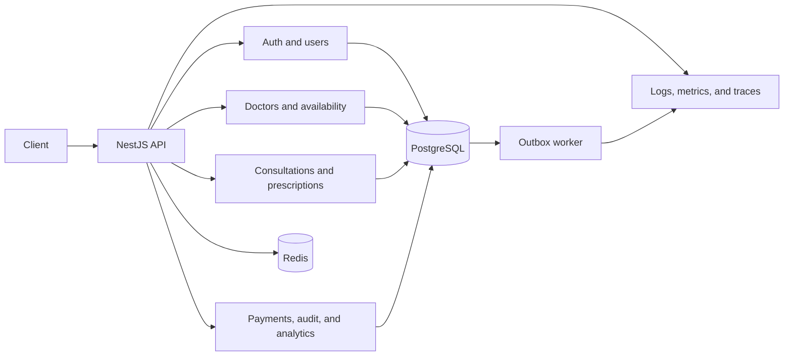
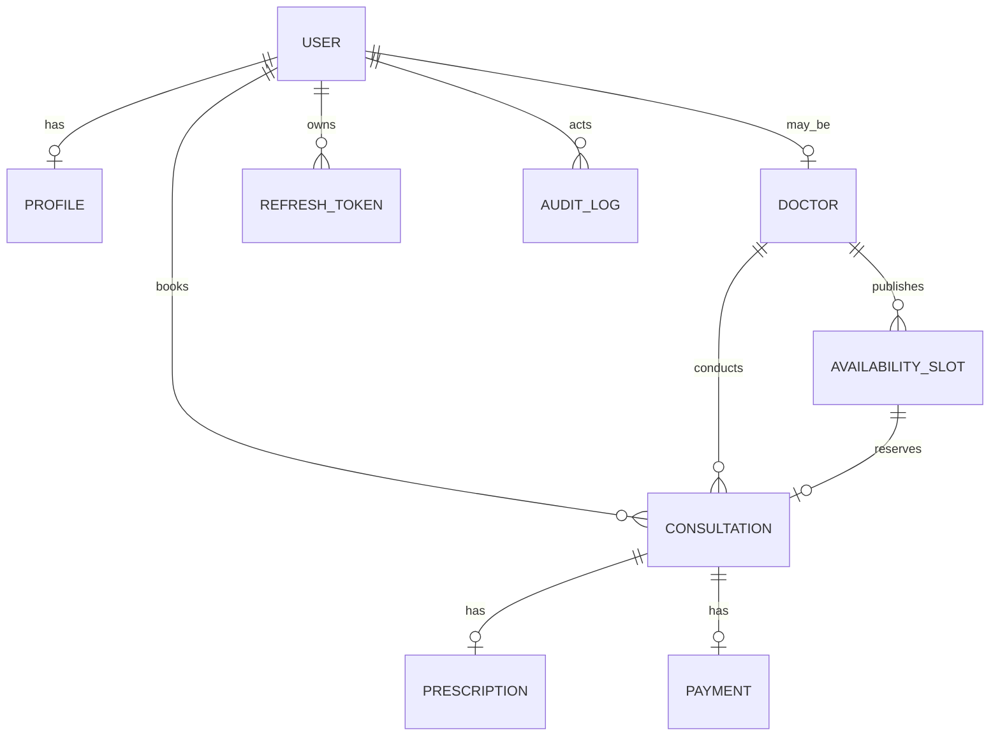

# Architecture

## Overview

The application is a NestJS modular monolith. PostgreSQL is the source of truth, Redis provides rate limiting and short-lived caches, and a separate worker processes committed outbox events.

## Modules

| Module          | Responsibility                                             |
| --------------- | ---------------------------------------------------------- |
| `auth`          | Registration, login, token rotation, and MFA               |
| `users`         | Profiles, user administration, and audit queries           |
| `doctors`       | Doctor search, activation, and availability                |
| `consultations` | Booking, lifecycle transitions, and prescriptions          |
| `payments`      | Payment-state updates                                      |
| `admin`         | Aggregate analytics                                        |
| `common`        | Guards, encryption, audit, idempotency, Redis, and metrics |
| `outbox`        | Reliable asynchronous event processing                     |

## Consistency

- Booking atomically claims an available slot and creates the consultation, payment, audit, idempotency response, and outbox event.
- PostgreSQL constraints prevent overlapping availability and duplicate active bookings.
- `expectedVersion` protects state transitions from stale updates.
- Idempotency keys are scoped to the user and route. A matching retry replays the stored response; a different payload returns `409`.
- Outbox delivery is at least once, so external consumers must deduplicate by event ID.

## Data model

The main entities are `users`, `profiles`, `doctors`, `availability_slots`, `consultations`, `prescriptions`, `payments`, `refresh_tokens`, `idempotency_records`, `audit_logs`, and `outbox_events`.

## Scaling approach

API and worker processes are stateless and can scale horizontally. PostgreSQL remains the consistency boundary. Redis failure may reduce caching or rate-limit availability, but it cannot permit double booking. The supplied load test checks the assignment latency targets; results depend on the deployment environment.
